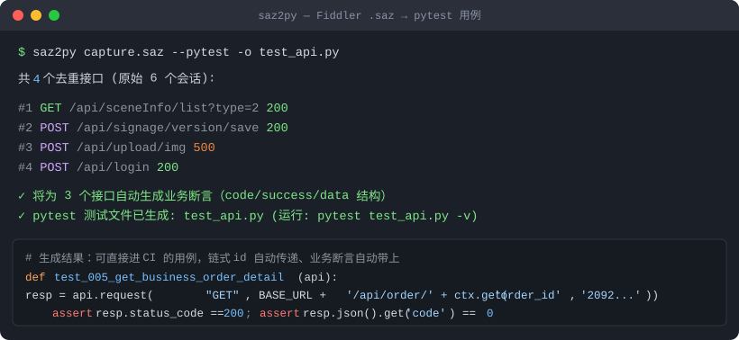

# saz2py 🎣

**把 Fiddler 的 `.saz` 抓包文件，一条命令变成可回放的 Python 脚本 / pytest 用例 / Postman 集合。**

Turn Fiddler `.saz` captures into replayable Python scripts, pytest suites and Postman collections — one command, zero config, zero dependency.




## 为什么需要它

抓包分析完接口后，把每个请求手工搬进 Postman、再手写成 requests 脚本，是最枯燥的体力活。

```bash
pip install saz2py          # 或直接下载单文件 saz2py.py
saz2py capture.saz --pytest -o test_api.py
pytest test_api.py -v       # 30 秒后你就有了一套接口回归用例
```

## 它和同类工具最大的不同

**状态码全绿 ≠ 接口正常。** 国内后端普遍用 HTTP 200 包装业务错误（`{"code": 401, "msg": "未授权"}`），只断言状态码的回放工具会给你假的"全部通过"。

saz2py 会从抓包响应里自动识别成功包装结构（`code==0` / `success==true` / `data` 字段），生成**业务级断言**——真实项目实测，同一个抓包：状态码断言 129/129 通过，业务断言立刻揪出全部 110 个已失效登录态的接口。

## 特性

| 特性                 | 说明                                                                                                                |
| ------------------ | ----------------------------------------------------------------------------------------------------------------- |
| 🪶 **零依赖单文件**      | 工具本体纯标准库（3.8+），单文件拷走即用；也可 `pip install saz2py`                                                                    |
| 🔍 **自动去重 + 噪音过滤** | 同接口只留最新参数；自动剔除 OPTIONS 预检、SPA 页面路由、Vite/Webpack 静态资源                                                              |
| 🔗 **链式变量**        | 自动识别「接口 A 响应里的 id → 接口 B 请求引用」：pytest 里生成 `ctx` 提取与传递（提取失败自动兜底抓包原值，链条永不断），Postman 里生成集合变量 `{{id}}` + 自动 set 的测试脚本 |
| ✅ **业务断言**         | 按抓包响应自动推断成功包装（`code`/`status`/`success`/`data`），pytest 与 Postman 同步生成                                             |
| 🧪 **pytest 模式**   | `--pytest` 生成标准用例：`requests.Session` fixture（连接复用+Cookie 保持）、按抓包顺序执行、可直接进 CI                                      |
| 📦 **Postman 迁移**  | Collection v2.1，Import 即用，链式变量与断言一并生成                                                                             |
| 🚑 **损坏恢复**        | .saz 导出中断/复制不全导致 zip 损坏时自动逐条目恢复——53MB 截断包实测救回 15402 个会话                                                           |
| 🎯 **URL 过滤**      | `-f 关键字` 只导出关心的接口                                                                                                 |
| 🛡 **坏数据容错**       | 跳过损坏会话，兼容 Fiddler 的 BOM 存储坑，兼容经典版与 Fiddler Everywhere 两种内部命名                                                      |

## 快速开始

```bash
# 不装依赖，直接用（推荐先 pip install requests，生成脚本才能跑）
python saz2py.py capture.saz                 # 列出抓包里的接口清单（自动去重）

# 生成 pytest 回归用例（推荐）
saz2py capture.saz --pytest -o test_api.py
pytest test_api.py -v

# 生成极简回放脚本
saz2py capture.saz -o replay.py

# 导出 Postman Collection
saz2py capture.saz --postman api.postman_collection.json

# 组合：只导出 URL 含 "order" 的接口
saz2py capture.saz --pytest -o test_order.py -f order
```

仓库里带了一个合成抓包 [examples/demo.saz](examples/demo.saz)，克隆后即可体验：

```bash
git clone https://github.com/tongzai1205/saz2py && cd saz2py
python saz2py.py examples/demo.saz --pytest -o test_demo.py
pytest test_demo.py -v
```

### 生成的 pytest 用例长这样

```python
BASE_URL = "http://your-server:8080"   # ← 抓包自动带入，改成目标环境即可
ctx = {}                               # 链式变量池

@pytest.fixture(scope="session")
def api():
    s = requests.Session()
    s.headers.update(HEADERS)          # 抓包里的真实登录态
    return s

def test_005_get_business_mixingstationdict_2092516(api):
    """GET /business/mixingstationdict/2092516...   (抓包状态: 200)"""
    resp = api.request("GET", BASE_URL + '/business/mixingstationdict/' + ctx.get('mixingstationdict_id', '2092516...'), ...)
    assert resp.status_code == 200, resp.text[:300]
    rj = resp.json()
    assert rj.get('code') == 0, '业务码异常(若登录态/token过期请更新 HEADERS 后重跑): ' + str(rj)[:200]

def test_020_post_business_mixingstationdict_update(api):
    # 生产者接口响应里自动提取 id，消费者接口 URL 自动引用 —— 全程零手工
    ctx['mixingstationdict_id'] = resp.json()['data']['id']
```

## 适用场景

- **接口自动化起步**：抓一遍业务流程 → 一条命令得到可回归的 pytest 用例
- **抓包 → Postman 迁移**：告别逐条手工搬运，链式 id 自动参数化
- **线上问题复盘**：回放现场请求复现问题
- **接口清单盘点**：一条命令列出系统全部业务接口

## 已知限制

- 仅支持 Fiddler `.saz`（HAR / Charles 支持在 Roadmap）
- 业务断言基于抓包时的响应结构推断，接口契约变更后需人工复核
- 相同接口保留**最后一次**抓包的参数
- 抓包里的登录态（Cookie/Token）有时效，回放前可能需要更新 `HEADERS`

## Roadmap

- [x] HAR / Charles 抓包格式支持
- [ ] 断言规则自定义（配置文件）
- [ ] HTML 测试报告
- [ ] `--merge` 多个抓包合并去重

## 真实项目战绩

| 抓包                     | 规模                  | 结果                                                           |
| ---------------------- | ------------------- | ------------------------------------------------------------ |
| 某混凝土搅拌站管理系统（53MB，截断损坏） | 15402 会话 → 112 业务接口 | 恢复模式救回全部数据，pytest 全量生成；登录态失效后**状态码断言仍全绿，业务断言揪出 93 个**业务层 401 |
| 某标识标牌管理系统（动态 token）    | 52 会话 → 17 业务接口     | 状态码 17/17 全绿，业务断言 17/17 红——token 过期只有在业务层才看得见                |
| 合成 demo 抓包             | 6 会话 → 4 接口         | `examples/demo.saz`，克隆即可复现                                   |

## Contributing

Issue / PR 都欢迎。发现你真实抓包里解析失败的场景，请附上报错信息（工具会自动打印内部条目结构辅助定位）。

本地开发：

```bash
pip install -e ".[test]"
python -m pytest tests -q     # 18 个用例，覆盖解析/生成/链式变量/断言/损坏恢复/端到端
```

CI 在 Python 3.9 ~ 3.13 全矩阵运行，并且会强制校验「本体不允许引入任何第三方依赖」。

## License

[MIT](LICENSE) © [tongzai1205](https://github.com/tongzai1205)
